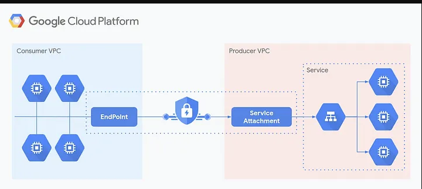

# Private Service Connect

This repository contains examples and configurations for implementing Google Cloud's Private Service Connect (PSC) between GKE clusters in different VPC networks.

## Overview

Private Service Connect (PSC) enables secure private connectivity between VPC networks, allowing services to communicate without exposing traffic to the public internet. This repository demonstrates two main patterns for using PSC with GKE:

1. **Direct workload connectivity** - Expose individual Kubernetes services across VPC boundaries
2. **Istio ingress gateway connectivity** - Expose multiple services through a single Istio ingress gateway

## Repository Contents

- `workload-psc.md` - Example for connecting directly to a workload using PSC
- `ingressgateway-psc.md` - Example for connecting to an Istio ingress gateway using PSC
- `images/` - Diagrams and illustrations
- Configuration examples for both producer and consumer sides

## Architecture Patterns

### Pattern 1: Direct Workload Connectivity

This pattern creates a PSC connection directly to a specific workload:

1. Producer side publishes a service via service attachment
2. Consumer side creates a PSC endpoint and forwarding rule
3. Consumer side creates a Kubernetes service pointing to the PSC endpoint
4. Traffic flows through the PSC connection to the target service

### Pattern 2: Istio Ingress Gateway Connectivity

This pattern creates a PSC connection to an Istio ingress gateway:

1. Producer side deploys an internal Istio ingress gateway with service attachment
2. Consumer side creates a PSC endpoint and forwarding rule to the gateway
3. Consumer side creates a Kubernetes service pointing to the PSC endpoint
4. Consumer side creates VirtualServices routing to different applications based on hostnames
5. Multiple services can be accessed through a single PSC connection

## Getting Started

See the detailed instructions in:
- [Direct Workload Example](workload-psc.md)
- [Istio Gateway Example](ingressgateway-psc.md)

## Prerequisites

- Two GKE clusters in different VPC networks
- Appropriate GCP permissions to create PSC resources
- Istio installed (for the gateway pattern)

## References

* [Private Service Connect Documentation](https://cloud.google.com/vpc/docs/private-service-connect)
* [PSC with GKE Example](https://codelabs.developers.google.com/cloudnet-psc-ilb-gke#0)
* [PSC with Internal Load Balancers](https://cloud.google.com/kubernetes-engine/docs/how-to/internal-load-balancing#psc)

## License

This project is licensed under the terms of the MIT license.