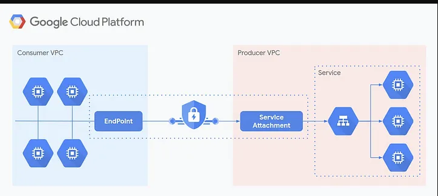

# WORKLOAD - Private Servcie Connect



## PLAY GKE CLUSTER (Service Producer)
### Create a subnet for Private Service Connect 
```shell
# You cannot use the same subnet in multiple service attachment configurations.
# find the correct IP cidr range here: https://mxtoolbox.com/subnetcalculator.aspx
gcloud compute networks subnets create psc-wherami-subnetwork \
    --project gcp-play \
    --network play-vpc-network \
    --region europe-west3 \
    --range 10.10.10.0/29 \
    --purpose PRIVATE_SERVICE_CONNECT
```

### Deploy a `whereami` service
```shell
kubectl apply -f workload-whereami.yaml
```

### Create ServiceAttachment
```shell
kubectl apply -f workload-serviceattachment.yaml
```

## STAGE GKE CLUSTER (Service Consumer)
### craete an ENDPOINT IP address at the consumer side for each PSC connection
**NOTE:** This enpoint IP address receives the traffic and route it to published service on Service Producer side via PSC subnet on Producer side 
```shell
# You cannot use the same subnet in multiple service attachment configurations.
# find the correct IP cidr range
gcloud compute addresses create endpoint-wherami-ip \
    --project=gcp-stage \
    --region=europe-west3 \
    --subnet=stage-kube-subnetwork \
    --purpose=GCE_ENDPOINT
```

### create a forwarding rule
```shell
gcloud compute forwarding-rules create psc-whereami \
    --project=gcp-stage \
    --region=europe-west3 \
    --network=stage-vpc-network \
    --subnet=stage-kube-subnetwork \
    --address=endpoint-wherami-ip \
    --target-service-attachment=projects/gcp-play/regions/europe-west3/serviceAttachments/whereami-<randomid>
```

### create virtualservice to access a workload running in PLAY using STAGE CLUSTER virtualservcie
### Create a Kubernetes Service to represent the PSC endpoint
```yaml
apiVersion: v1
kind: Service
metadata:
  name: play-whereami
  namespace: default
spec:
  type: ClusterIP
  ports:
  - port: 80
    targetPort: 80
    protocol: TCP
    name: http
---
apiVersion: v1
kind: Endpoints
metadata:
  name: play-whereami # Name should match with service name
  namespace: default
subsets:
- addresses:
  - ip: ENDPOINT_IP_ADDRESS  # Replace with the actual endpoint-wherami-ip value
  ports:
  - port: 80
    name: http
```

### Create an Istio VirtualService to route traffic
```yaml
apiVersion: networking.istio.io/v1
kind: VirtualService
metadata:
  name: play-whereami
  namespace: default
spec:
  hosts:
  - "whereami.stage.fff.services"
  gateways:
  - istio-ingress/istio-gateway
  # - istio-ingress-private/istio-gateway
  http:
  - route:
    - destination:
        host: play-whereami  # Must match the service name above
        port:
          number: 80
```
## References
* [PSC Example](https://codelabs.developers.google.com/cloudnet-psc-ilb-gke#0)